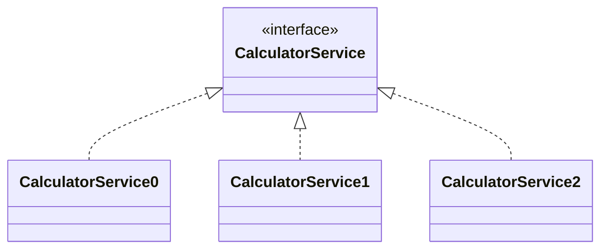

## 七. Service

###### 1. 数据与逻辑分离

之前我们讲面向对象设计，都是把数据和逻辑放在一起，这是理想情况。

现实情况是，把对象分为两类，一类专门存数据，一类专门执行逻辑，如下

> 混在一起有什么缺点呢
>
> * 数据是方法调用时才能确定的，只有请求来了，才知道数据（p，m,  yr）是什么，才能根据它们创建这个既包含数据，也包含逻辑的对象，而对象的逻辑部分是一样的，重复创建感觉有点浪费
> * 如果把数据和逻辑分离开
>   * 数据对象才需要每次请求来了创建
>   * 逻辑对象只需一开始创建一次就足够了
>
>
> 因此把数据和逻辑分成 java bean 和 service 能让你的代码更灵活，这也是这么做的目的

存数据的就是一个 Java Bean

```java
public class Calculator {
    private double p;
    private int m;
    private double yr;

    public Calculator(double p, int m, double yr) {
        this.p = p;
        this.m = m;
        this.yr = yr;
    }
    
    // 省略 get set 方法
}
```

存逻辑的叫做 XxxService，例如

```java
class CalculatorService0 {
    public String[] cal(Calculator c) {
        double p = c.getP();
        int m = c.getM();
        double mr = c.getYr() / 12 / 100.0;
        double pow = Math.pow(1 + mr, m);
        double payment = p * mr * pow / (pow - 1);
        return new String[]{
                NumberFormat.getCurrencyInstance().format(payment * m),
                NumberFormat.getCurrencyInstance().format(payment * m - p)
        };
    }

    public String[][] details(Calculator c) {
        double p = c.getP();
        int m = c.getM();
        String[][] a2 = new String[m][];
        double mr = c.getYr() / 12 / 100.0;
        double pow = Math.pow(1 + mr, m);
        double payment = p * mr * pow / (pow - 1);              // 月供
        for (int i = 0; i < m; i++) {
            double payInterest = c.getP() * mr;                        // 偿还利息
            double payPrincipal = payment - payInterest;        // 偿还本金
            p -= payPrincipal;                                  // 剩余本金
            a2[i] = createRow(payment, i, payInterest, payPrincipal, p);
        }
        return a2;
    }
    
    private String[] createRow(double payment, int i, double payInterest, double payPrincipal, double p) {
        return new String[]{                       // 一行的数据
                (i + 1) + "",
                NumberFormat.getCurrencyInstance().format(payment),
                NumberFormat.getCurrencyInstance().format(payPrincipal),
                NumberFormat.getCurrencyInstance().format(payInterest),
                NumberFormat.getCurrencyInstance().format(p)
        };
    }

}
```

显然，Service 根据计算方式不同，有多个

* 要使用多态来避免根据类型的 if else 判断，这回可以使用接口，接口中添加两个抽象方法 cal 和 details，让这几个 Service 都实现它，并完成方法重写
* 至于那个重复的 createRow 方法，可以作为接口中的 default 方法被实现类重用

```java
public interface Cal {

    String[] cal(Calculator c);

    String[][] details(Calculator c);

    default String[] createRow(double payment, int i, double payInterest, double payPrincipal, double p) {
        return new String[]{                       // 一行的数据
                (i + 1) + "",
                NumberFormat.getCurrencyInstance().format(payment),
                NumberFormat.getCurrencyInstance().format(payPrincipal),
                NumberFormat.getCurrencyInstance().format(payInterest),
                NumberFormat.getCurrencyInstance().format(p)
        };
    }
}

class CalculatorService0 implements Cal {
    public String[] cal(Calculator c) {
        // ...
    }
    public String[][] details(Calculator c) {
        // ...
    }
}

class CalculatorService1 implements Cal {
    public String[] cal(Calculator c) {
        // ...
    }
    public String[][] details(Calculator c) {
        // ...
    }
}

class CalculatorService2 implements Cal {
    public String[] cal(Calculator c) {
        // ...
    }
    public String[][] details(Calculator c) {
        // ...
    }
}
```

Controller 的代码变成了

```java
@Controller
public class CalController {

	// ...
    
    private Cal[] calArray = new Cal[]{
            new CalculatorService0(),
            new CalculatorService1(),
            new CalculatorService2()
    };


    @RequestMapping("/cal")
    @ResponseBody
    String[] cal(double p, int m, double yr, int type) {
        System.out.println(calArray[type]);
        return calArray[type].cal(new Calculator(p, m, yr));
    }

    @RequestMapping("/details")
    @ResponseBody
    String[][] details(double p, int m, double yr, int type) {
        return calArray[type].details(new Calculator(p, m, yr));
    }

}
```


###### 2. 控制反转

一直以来，都是我们自己用 new 关键字配合构造方法来创建对象，但我们现在用的是 Spring 框架，可以把一些创建对象的活交给 Spring 框架去做。

那么 Spring 框架怎么创建对象呢？它主要是配合一些注解来完成对象的创建，例如，我们一直在用的 @Controller 注解，当 Spring 程序运行时，它会检查这些类上有没有加一些特殊注解，例如它发现这个类上加了 @Controller 注解，框架就知道，该由框架来创建这个 CalculatorController 对象，默认只会创建一个。

这样的注解还有不少，我们现在需要掌握的有 @Controller 算一个，还有一个是 @Service，试试把这些 Service 类的创建交给 Spring 吧：

```java
@Service
class CalculatorService0 implements Cal {
    public String[] cal(Calculator c) {
    }
    public String[][] details(Calculator c) {
    }
}

@Service
class CalculatorService1 implements Cal {
    public String[] cal(Calculator c) {
    }
    public String[][] details(Calculator c) {
    }
}

@Service
class CalculatorService2 implements Cal {
    public String[] cal(Calculator c) {
    }
    public String[][] details(Calculator c) {
    }
}
```

* @Service 的作用就是告诉 Spring，这个类以后要创建对象的话，不归程序员管了啊，归 Spring 管
* 其实 @Controller 的作用也是类似的，控制器对象虽然我们没 new，实际由 Spring 来创建了

把对象的创建权交给 Spring 来完成，对象的创建权被交出去，这称之为控制反转


###### 3. 依赖注入

那么我们的代码里怎么拿到 Spring 创建的对象呢？

```java
@Controller
public class CalController {

	// ...
    
    @Autowired
    private Cal[] calArray;
    
    // ...
    
}
```

这儿又要引入一个相关的名词：依赖注入

比如说，这里的 控制器 需要 service 才能工作，就可以说控制器对象依赖于 service 对象，缺了这些依赖对象行吗？不行吧。怎么找到这些依赖对象呢？如果是框架帮你找到这些依赖对象，按一定规则提供给你，就称之为依赖注入

怎么让框架帮你找到这些依赖对象呢？答案是 @Autowired 




在 Cal[] 数组上添加 @Autowired 即可，它是根据类型去问 Spring 要对象，Spring 中有很多对象，具体要哪个对象呢？答案是根据**类型**要

* Cal 表示，只要 Spring 创建的对象实现了 Cal 接口，就符合条件
* Cal[] 表示，要多个
* 最终的结果是找到 Spring 管理的 CalculatorService0、CalculatorService1、CalculatorService2 三个对象，并放入了 Cal[] 数组


###### 4. 由Spring创建JavaBean

Spring 还可以根据请求中的多个查询参数，帮我们创建 JavaBean 数据对象

```java
@Controller
public class CalController {

    // ...

    @Autowired
    private Cal[] calArray;


    @RequestMapping("/cal")
    @ResponseBody
    String[] cal(Calculator c, int type) {
        return calArray[type].cal(c);
    }

    @RequestMapping("/details")
    @ResponseBody
    String[][] details(Calculator c, int type) {
        return calArray[type].details(c);
    }

}
```

* 如果提供了无参构造，Spring 会优先用它来创建对象，并调用 setXXX 方法，对属性进行赋值
  * 查询参数有 p，那么 Spring 会找一个名为 setP 的方法完成赋值
  * 查询参数有 m，那么 Spring 会找一个名为 setM 的方法完成赋值
  * 查询参数有 yr，那么 Spring 会找一个名为 setYr 的方法完成赋值
  * 查询参数有 type，但 Calculator 对象没有 setType 方法，所以 type 并不会存入对象
* 如果没有无参构造，但提供了有参构造，Spring 会拿构造方法参数名与查询参数相对应，并完成赋值
  * 我们的例子中，查询参数有 p，m，yr，构造方法参数名也叫 p，m，yr，根据对应关系完成赋值


> 注意
>
> * 不是所有 JavaBean 对象都应该交给 Spring 创建，一般只有请求中的数据，才会这么做


###### 5. 包结构约定

这节课讲讲包结构约定，之前我们也讲过当类的数目比较多时，要根据它们的功能，进一步划分 package，以便更好的管理。 目前可以划分 3 个包

* controller 包，用来存放控制器类
* service 包，用来存放业务逻辑类
* dto 包，用来存放存数据的 JavaBean 类，dto 是 Data Transfer Object（数据传输对象）的缩写


最后要注意一下入口类的位置，必须放在 service, controller 这几个包的上一层，为什么呢？

这个入口类，它还肩负了一个职责，查找 @Service, @Controller 等注解的类，然后创建对象。它查找的范围是在这个类的当前 package 之内，因此如果 service，controller 等包如果不在这个 package 内，那么会查找不到