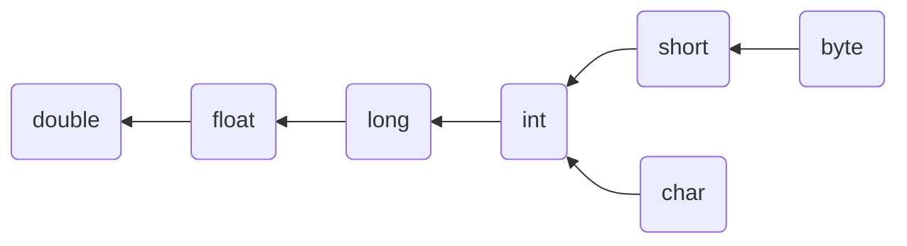
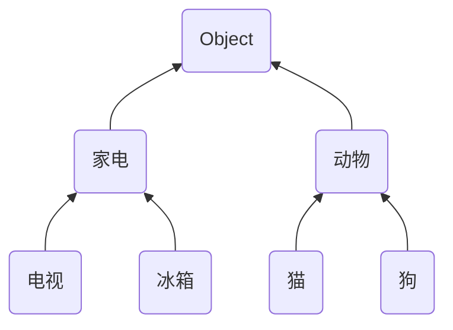

## 三. 继承

###### 1. 继承语法

阅读代码发现，这两个类中有一些相同的对象变量和方法代码，能否减少这两个类的重复代码，答案是继承

继承的语法

```java
class 父类 {
    字段;
    方法() {}
}

class 子类 extends 父类 {
    
}
```


可以用父子类继承的方式减少重复声明，例如 A 是父类，B，C 类是子类，那么


```java
class A {
    String name;
    void test() {}
}

class B extends A {
}

class C extends A {
}
```

* 子类能从父类中继承它所声明的字段、方法

但注意，构造方法不能继承

* 给父类加一个带参构造，发现子类都报错了，为什么呢？一方面构造方法不能继承
* 另一方面对子类来说，你得调用父类的带参构造给父类的 name 字段赋值吧
* 子类得先创建自己的构造方法，然后用 super 调用父类的带参构造

```java
class A {
    String name;
    A(String name) {
        this.name = name;
    }
    void test() {}
}

class B extends A {
    B(String name) {
        super(name);
    }
}

class C extends A {
    C(String name) {
        super(name);
    }
}
```


###### 2. 贷款计算器 - 继承改造

回到我们的例子

第一步，减少重复的字段声明，定义一个父类型，里面放 p、m、yr 这三个字段

```java
public class Calculator {
    double p;
    int m;
    double yr;

    Calculator(double p, int m, double yr) {
        this.p = p;
        this.m = m;
        this.yr = yr;
    }
}
```

然后子类中不必再写这三个字段

```java
class Calculator0 extends Calculator{

    Calculator0(double p, int m, double yr) {
        super(p, m, yr);
    }
    
    // ...
}

class Calculator1 extends Calculator{

    Calculator1(double p, int m, double yr) {
        super(p, m, yr);
    }
    
    // ...
}
```


第二步，分析哪些代码重复：

可以看到详情中生成一行数据的代码重复了，抽取为父类的方法，然后子类可以重用

```java
public class Calculator {
    // ...

    String[] createRow(double payment, int i, double payInterest, double payPrincipal) {
        return new String[]{                       // 一行的数据
                (i + 1) + "",
                NumberFormat.getCurrencyInstance().format(payment),
                NumberFormat.getCurrencyInstance().format(payPrincipal),
                NumberFormat.getCurrencyInstance().format(payInterest),
                NumberFormat.getCurrencyInstance().format(p)
        };
    }
}
```

例如

```java
public class Calculator0 extends Calculator {

    // ...

    @Override
    String[][] details() {
        String[][] a2 = new String[m][];
        double mr = yr / 12 / 100.0;
        double pow = Math.pow(1 + mr, m);
        double payment = p * mr * pow / (pow - 1);              // 月供
        for (int i = 0; i < m; i++) {
            double payInterest = p * mr;                        // 偿还利息
            double payPrincipal = payment - payInterest;        // 偿还本金
            p -= payPrincipal;                                  // 剩余本金

            // 这里重用了从父类继承的方法
            a2[i] = createRow(i, payment, payPrincipal, payInterest);
        }
        return a2;
    }
}
```


继承能够减少字段定义和方法定义的重复代码

* 不重复意味着代码的可维护性提高
* 重复意味着一处修改，凡是重复的地方都要跟着修改


###### 3. java 类型系统

java 中的类型分成了两大类

* 基本类型 primitive type
  * 整数 byte short int long
  * 小数 float double
  * 字符 char
  * 布尔 boolean

* 引用类型 reference type
  * 除了基本类型以外的其它类型都属于引用类型，引用类型可以看成是由基本类型组成的复杂类型，例如
    * String 内部由 byte[] 组成，而 byte[] 又是由 byte 组成
    * Phone 内部价格是 double，品牌等都是 String
  * 包装类型
    * 每个基本类型都有与之对应的包装类型，见下表
    * 包装类型是对象，既然是对象，就可以有对象的特征，如字段、方法、继承 ...
  * null 值，不能对 null 值进一步使用（使用字段、调用方法），例如
    * String str = null;
    * str.length() 求字符串长度时，就会出现 NullPointerException 空指针异常
    * 使用引用类型之前，最好做非空判断，例如：if(str != null)  再做进一步操作

| 包装类型  | 基本类型 | 备注 |
| --------- | -------- | ---- |
| Byte      | byte     |      |
| Short     | short    |      |
| Integer   | int      |      |
| Long      | long     |      |
| Float     | float    |      |
| Double    | double   |      |
| Character | char     |      |
| Boolean   | boolean  |      |


###### 4. 类型转换

######## 1) 基本类型转换



* 整数和 char 7种类型
  * 顺箭头方向隐式转换
  * 逆箭头方向需要显式强制转换，可能会损失精度
* boolean 类型无法与其它基本类型转换
* short 与 char 也不能转换


隐式转换

```java
byte a = 10;
int b = a; // 自动从 byte 转换为 int
```

强制转换

```java
int c = 20;
byte d = (byte) c; // 在圆括号内加上要转换的目标类型
```

强制转换可能损失精度

```java
int c = 1000;
byte d = (byte) c; // byte 的数字范围就是在 -128 ~ 127，存不下 1000，最后结果是 -24
```


######## 2) 包装类型转换

```mermaid
graph TD
subgraph 1 
    byte ---> Byte
    Byte ---> byte
end

subgraph 2
short ---> Short
Short ---> short
end

subgraph 3
int ---> Integer
Integer ---> int
end

subgraph 4
long ---> Long
Long ---> long
end

subgraph 5
float ---> Float
Float ---> float
end

subgraph 6
double ---> Double
Double ---> double
end

subgraph 7
char ---> Character
Character ---> char
end

subgraph 8
boolean ---> Boolean
Boolean ---> boolean
end
```



* 包装类型和它对应的基本类型之间可以自动转换，如

```java
int a = 20;
Integer b = a;

Integer c = new Integer(30);
int d = c;
```


######## 3) 引用类型转换

############ Java 继承的特点

1. 单继承，子类只能继承一个父类
2. Object 是所有其它类型直接或间接的父类型，定义 class 时，不写 extends 这个类也是继承自 Object
3. 子类与父类、祖先类之间，可以用【是一个 is a】的关系来表达

############ 向上向下转型



* 顺箭头方向（向上）隐式转换，即子类可以用它的更高层的类型代表，表达一种**是一个**的关系
  * 例如一个猫对象，可以隐式转换为动物

    ```java
    Animal a = new Cat(); // 用父类型的变量 a 代表了一只猫对象
    Object b = new Cat(); // 用祖先类型的变量 b 代表了一只猫对象
    ```
  
* 逆箭头方向（向下）首先要符合**是一个**规则，然后用显式强制转换
  * 如果一个动物变量，它代表的**是一个**猫对象，可以通过强制转换还原成猫
  
    ```java
    Animal a = new Cat();
    Cat c = (Cat) a;
    ```
  
  * 如果一个动物变量，它代表的**是一个**猫对象，即使强制转换，也不能变成狗，编译不报错，但运行就会出现 ClassCastException
  
    ```java
    Animal a = new Cat();
    Dog d = (Dog) a;
    ```


为什么需要向上转型？主要是为了使用父类统一处理子类型

例1：

```java
static void test(Animal a) {
    
}
```

这时，此方法既可以处理猫对象，也可以处理狗对象

```java
test(new Cat());
test(new Dog());
```


例2：用父类型的数组，可以既装猫对象，也装狗对象

```java
Animal[] as = new Animal[]{ new Cat(), new Dog() };
```


############ 类型判断

```java
Animal a = new Cat();
```

如果想知道变量 a 代表对象的实际类型，可以使用

```java
System.out.println(a.getClass()); // 输出结果 class com.itheima.Cat
```

* getClass() 是对象从 Object 类中继承的方法


如果想检查某个对象和类型之间是否符合【是一个】的关系，可以使用

```java
Animals a = new Cat();
Object b = new Cat();

System.out.println(a instanceof Cat);   // true
System.out.println(a instanceof Dog);   // false
System.out.println(b instanceof Animal);// true
```

经常用在向下转型之前，符合是一个的关系，再做强制类型转换


######## 4) 其它类型转换

除了以上转换规则，在赋值、方法调用时，一旦发现类型不一致，都会提示编译错误，需要使用一些转换方法才行

例如：两个字符串对象要转成整数做加法

```java
String a = "1";
String b = "2";

System.out.println(a + b); // 这样不行，字符串相加结果会拼接为 12
System.out.println(Integer.parseInt(a) + Integer.parseInt(b)); // 转换后再相加，结果是 3
```