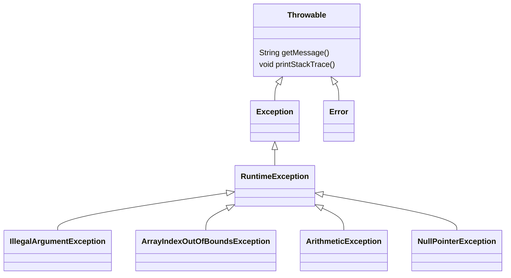

## 九. 异常处理

###### 1. try - catch 

回忆之前我们对异常的使用，我们用异常改变了方法执行流程

```java
public class TestTry {

    public static void main(String[] args) {
        System.out.println(1);
        test(0.0);
        System.out.println(3);
    }

    public static void test(double p) {
        if(p <= 0.0) {
            // 异常也是一个对象, 包含的是错误描述
            throw new IllegalArgumentException("本金必须大于 0"); // 1 处
        }
        System.out.println(2);
    }
}
```

输出

```
1
Exception in thread "main" java.lang.IllegalArgumentException: 本金必须大于 0
	at com.itheima.module3.TestTry.test(TestTry.java:13)
	at com.itheima.module3.TestTry.main(TestTry.java:7)
```


这个例子中，执行到 1 处出现了异常，后续的输出 2、3 的代码都不会执行了

但如果希望，一个方法出现异常后，不要影响其它方法继续运行，可以用下面的语法来处理

```java
public class TestTry {

    public static void main(String[] args) {
        System.out.println(1);
        try {
            test(0.0);
        } catch (IllegalArgumentException e) {
            System.out.println(e);
        }
        System.out.println(3);
    }

    public static void test(double p) {
        if (p <= 0.0) {
            throw new IllegalArgumentException("本金必须大于 0");
        }
        System.out.println(2);
    }
}
```

输出

```
1
java.lang.IllegalArgumentException: 本金必须大于 0
3
```

执行流程为

* 试着执行 try 块中的代码，如果没异常，一切照旧
* 现在 try 块内的代码出现了异常：test 方法抛出 IllegalArgumentException 异常对象，异常抛给 test 方法的上一层：main 方法，test 的剩余代码不会执行
* main 方法中的 catch 能够捕捉 IllegalArgumentException 异常对象，代码进入 catch 块
* 执行 catch 块内的代码
* 继续运行后续代码 System.out.println(3)


如果把 catch 的异常类型改为 NullPointerException

* 那么 catch 捉不住 IllegalArgumentException 异常对象，这个异常对象会继续向上抛，抛给 main 方法的上一层
* main 方法的上一次是 jvm，当 jvm 收到异常，就会终止整个程序执行

如果不加 try - catch 块，异常对象也会继续从 main 方法抛给 jvm，jvm 收到异常终止程序执行

如果把 catch 的异常类型改为 Exception

* 那么 catch 也能捉住 IllegalArgumentException 异常对象
* catch 能不能捉异常，是看实际异常对象和 catch 所声明的异常类型是否满足**是一个**的关系，即
  * 能够向上转型，就能捉
  * 不能向上转型，就捉不住
* 异常的继承关系见下一节的图，通常会在 catch 处声明 Exception 类型，这样就能统一捕获它的所有子类异常对象


###### 2. 继承体系



* Throwable 是异常中最顶层的父类
  * getMessage() 提供获取异常信息的功能
  * printStackTrace() 会在【标准错误】输出方法的调用链，用于定位错误位置
* Error 代表无药可救的异常，通常这种异常就算 catch 也救不了
* Exception 代表还可以救一救的异常，catch 后可以让程序恢复运行
* 我们见过的异常有
  * IllegalArgumentException 非法参数异常
  * ArrayIndexOutOfBoundsException 数组越界异常
  * ArithmeticException 算术异常
  * NullPointerException 空指针异常


###### 3. Spring 处理异常

问题：为何之前我们控制器中出现的异常不用 try - catch 处理？

* 控制器方法是由 Spring 的方法来调用的，因此控制器方法中出现异常，会抛给 Spring 方法
* Spring 的方法内部用了 try - catch 来捕捉异常，并在 catch 块中会把异常信息作为响应返回

我们当然也能自己 catch 异常，但可悲的是，你就算 catch 住异常又能干什么呢？还得考虑自己如何把异常信息转换为响应，还不如不 catch，交给 Spring 去处理


###### 4. 编译异常与运行时异常

异常按语法可以分成两类

* 运行时异常（也称未检查异常）
  * Error 以及它的子类
  * RuntimeException 以及它的子类
* 编译异常（也称检查异常）
  * 除掉运行时以外的所有异常，都属于编译异常

分别举一个例子：throw 一个运行时异常，没有额外语法，此异常抛给上一层方法来处理

```java
public static void test(double p) {
    if (p <= 0.0) {
        throw new IllegalArgumentException("本金必须大于 0");
    }
    System.out.println(2);
}
```


如果 throw 一个编译异常

```java
public static void test(double p) {
    if (p <= 0.0) {
        throw new Exception("本金必须大于 0"); // 语法报错了！
    }
    System.out.println(2);
}
```

* 编译异常要求在语法上对异常的处理做出选择，而且选择是强制的，只能下面两个选择二选一
  * 选择1，自己处理：加 try catch 语句
  * 选择2，抛给上一层方法做处理：用 throws 声明 

```java
public static void test(double p) throws Exception {
    if (p <= 0.0) {
        throw new Exception("本金必须大于 0");
    }
    System.out.println(2);
}
```

但编译时异常的烦人之处在于，当编译时异常抛给上一层方法后，上一层方法也被迫做出类似的选择


###### 5. finally 

如果无论是否出现异常，都一定要执行的代码，可以用 finally 语法

```java
try {
    
} catch (Exception e) {
    
} finally {
    
}
```

其中 catch 不是必须的，可以 try 与 finally 一起用


那这个 finally 的使用场景是什么呢？

以后我们的代码常常需要与一些外部资源打交道，外部资源有文件、数据库等等。这些外部资源使用时都有个注意事项，就是用完后得把资源及时释放关闭，资源都是有限的，如果用完不关，最终会导致资源耗尽，程序也无法继续运行了。将来这边代表资源的对象一般都会提供一个名为 close 的方法，用来释放资源。显然在 finally 中调用资源的 close 方法最为科学

```java
public class TestFinally {
    public static void main(String[] args) {
		Resource r = new Resource();
        try {
            System.out.println("使用资源");
            int i = 1 / 0;
        } catch (Exception e) {
            System.out.println(e);
        } finally {
            r.close();
        }
    }
}

class Resource implements Closeable {
    @Override
    public void close() {
        System.out.println("释放资源");
    }
}
```


如果资源实现了 Closeable 接口，那么可以用 try-with-resource 语法来省略 finally

```java
public class TestFinally {
    public static void main(String[] args) {
        // try - with - resource
        try (Resource r = new Resource()) {
            System.out.println("使用资源");
			int i = 1 / 0;
        } catch (Exception e) {
            System.out.println(e);
        }
    }
}

class Resource implements Closeable {
    @Override
    public void close() {
        System.out.println("释放资源");
    }
}
```