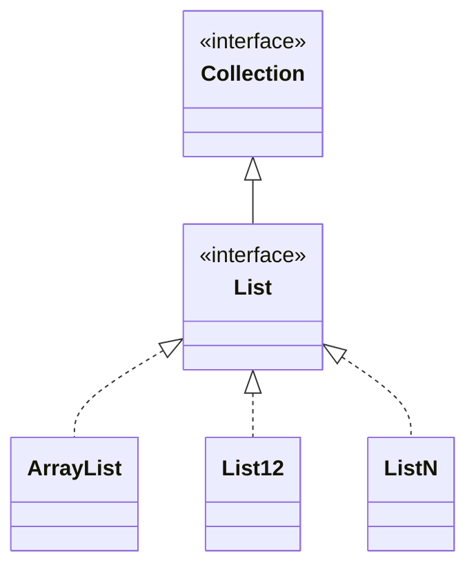
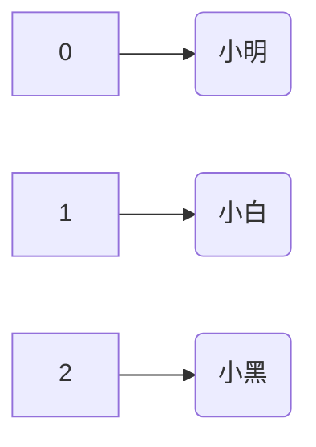
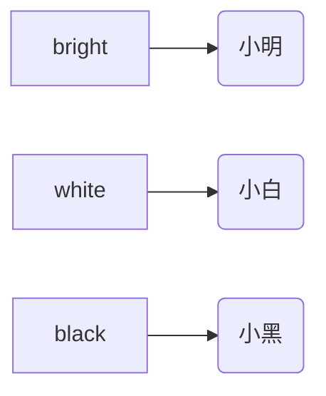

## 八. 核心类库

###### 1. ArrayList

######## 数组缺点

接下来需要讲解的是 ArrayList，它常常被用来替代数组

数组的缺点：不能自动扩容，比如已经创建了大小为 5 的数组，再想放入一个元素，就放不下了，需要创建更大的数组，还得把旧数组的元素迁移过去。

自己来做比较麻烦

```java
public class TestArray {
    public static void main(String[] args) {
        String[] arr0 = new String[]{"a", "b", "c", "d", "e"};
        String[] arr1 = new String[6];
        for (int i = 0; i < arr0.length; i++) {
            arr1[i] = arr0[i];
        }
        arr1[5] = "f";
        System.out.println(Arrays.toString(arr0));
        System.out.println(Arrays.toString(arr1));
    }
}
```

* 想看数组内所有元素，循环遍历，依次打印是一个办法
* 用 Arrays.toString 方法是更简单的办法


######## ArrayList 自动扩容

这时可以使用 ArrayList 来替代 String[]，它的内部仍然是数组，只是封装了更多实用的逻辑

```java
ArrayList list = new ArrayList(5); // 指定初始容量为 5, 如果不指定默认是 10
list.add("a");
list.add("b");
list.add("c");
list.add("d");
list.add("e");

// 不用担心容量不够, 它内部封装了扩容的逻辑, 每次按原来容量的 1.5 扩容, 向下取整, 如 5->7->10 
list.add("f");
System.out.println(list);
```

* ArrayList 每次扩容后，会预留一些空位，避免了频繁扩容
* 封装带来的问题是看不到内部的结构，没关系，可以使用 debug 工具来调试


######## Debug 调试

前面说了，ArrayList 封装了扩容逻辑，这对使用者当然是一件好事，就像我们平时使用家用电器似的，不需要知道这些电器内部如何工作，只需要会按它们对外的几个开关、按钮就足够了。像这个 ArrayList，我们只需要会创建对象，调用它的add方法就够用了，不需要看它内部结构

不过呢，有利必然有弊，比如你想观察验证它的扩容规则是不是真的是如我所说的 1.5 倍，封装就会带来障碍。这里交给大家一招深入对象内部，探究它组成结构的好办法，debug 调试。

debug 的第一步要添加断点，所谓断点就是让代码运行到断点处先停下来，不要向下走了，这样就能方便我们观察对象状态。在 18 行加一个断点，然后记得用调试模式运行代码


要查看 list 的详情，先按照下图进行选择查看方式


这样就可以观察 list 的内部结构了


以上介绍了一些基本的调试方法，更多的调试方法请关注笑傲篇的高级内容


######## ArrayList 遍历与泛型

List 的遍历有多种办法，这里只介绍最简单的一种

```java
for (Object e : list) {
    System.out.println(e);
}

// 与之对比, 数组也能类似方式进行遍历
for (String s : arr0) {
    System.out.println(s);
}
```

* 这种遍历称之为增强 for 循环


上例中的 list 是把元素当作 Object 加入到它的内部，再取出来也会当作 Object，有时候，就会不方便
* 例如 list 里放的都是整数，想做个累加

可以用泛型来限制元素的存取类型，例如

*  `ArrayList<String>` 专门存取字符串类型元素
* `ArrayList<Integer>` 专门存取整数类型元素
  * List 中只能存引用类型，不能直接存基本类型

例如

```java
ArrayList<Integer> list = new ArrayList<Integer>(5);
list.add(1);
list.add(2);
list.add(3);
list.add(4); // 按 Integer 存

int sum = 0;
for (Integer i : list) { // 按 Integer 取
    sum += i;
}

System.out.println(sum);
```

其中等式右边的 `<String>`  可以简化为 `<>`


######## List 接口



* ArrayList 是 List 接口的一个实现类
* 除它以外，还有 List12 和 ListN 等实现类
  * 他俩的特点是一旦 list 中元素确定，就不能再向 list 添加、移除元素


```java
List<Integer> list2 = List.of(1, 2, 3, 4);
System.out.println(list2.getClass()); // class java.util.ImmutableCollections$ListN


List<Integer> list3 = List.of(1, 2);
System.out.println(list3.getClass()); // class java.util.ImmutableCollections$List12
```

* of 方法隐藏了内部实现细节，对于使用者不需要关心对象的实际类型。

* 要是真想知道这个对象的类型是什么可以不？可以用继承自 Object 的 getClass 方法获得对象的真正类型


###### 2. HashMap

`String[]` 和 `ArrayList<String>` 都有一个缺点：查找其中某个元素不高效，例如：

```java
public static String find1(String value) {
    String[] array = new String[]{"小明", "小白", "小黑"};
    for (String s : array) {
        if (s.equals(value)) {
            return s;
        }
    }
    return null;
}

public static String find2(String value) {
    List<String> list = List.of("小明", "小白", "小黑");
    for (String s : list) {
        if (s.equals(value)) {
            return s;
        }
    }
    return null;
}
```

可以想象，如果集合大小为 n，而要查找的元素是最后一个，需要比较 n 次才能找到元素


解决思路，人为建立一种【映射】关系，比如：



* 0、1、2，是小明、小白、小黑的代号

```java
public static String find1(int key) {
    String[] array = new String[]{"小明", "小白", "小黑"};
    if (key < 0 || key >= array.length) {
        return null;
    }
    return array[key];
}

public static String find2(int key) {
    List<String> list = List.of("小明", "小白", "小黑");
    if (key < 0 || key >= list.size()) {
        return null;
    }
    return list.get(key);
}
```

* 可以看到，不用逐一比较了，当前前提是要知道这个对应关系
* 前面选择 CalculatorService 对象时，也用了这个技巧

但 0、1、2 意思不是很直白，如果元素数量较多，容易弄混，如果能起个更有意义的名字是不是更好？这就是下面要讲的 Map




什么是 Map 呢，很简单，它就是一组映射关系。

你看刚才的例子中，是建立了数组索引和数据元素之间的映射关系，根据索引快速找到元素。现在 map 也是一组映射关系，只是把索引变得更有意义而已。用 bright 映射小明，white 映射小白，black 映射小黑，前面的 bright、white、black 称之为 key ，key 需要唯一 ， 后面这些称之为 value 

代码如下：

```java
public static String find3(String key) {
    Map<String, String> map = Map.of(
        "bright", "小明",
        "white", "小白",
        "black", "小黑"
    );
    return map.get(key);
}
```


Map 需要掌握的点：

* 可以用泛型限制 Map 中 key 和 value 的类型
* Map.of 用来创建不可变的 Map，即初始时确定了有哪些 key 和 value，之后就不能新增或删除了
  * 根据 key 获取 value，用 get(key) 方法
* 如果想创建可变的 Map，用 new HashMap()
  * 存入新的 key，value，用 put(key, value) 方法
* 遍历 Map 也有多种方法，这里介绍一种相对好用的：

```java
for (Map.Entry<String, String> e : map.entrySet()) {
    // e.getKey()    获取 key
    // e.getValue()  获取 value
}
```

* 其中 Map.Entry 代表一对儿 key，value
* map.entrySet() 方法来获取所有的 entry