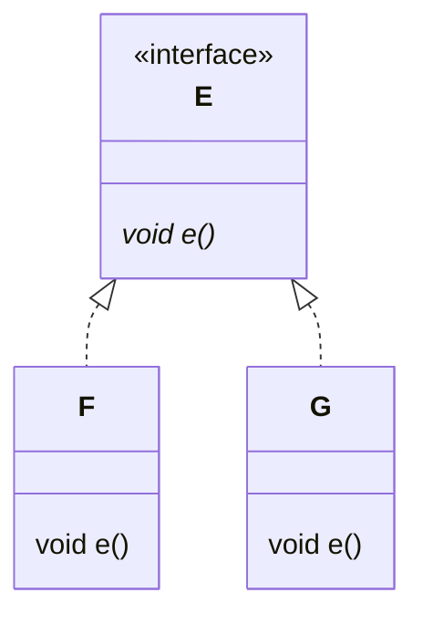

## 六. 接口

###### 特性1 - 解决单继承

这节课来学习单继承的问题

咱们都知道，java 中只支持单继承，也就是对于子类来讲，只能继承一个父类，但这样会出现代码重用方面的问题。看这个例子


* 如果设计一个父类，鸟，现在要写一个飞这个方法，而且代码实现都一样，因此我把这个飞方法，放在了父类当中，让子类继承，然后新写了一个鸭子子类，还用写飞这个方法吗？不必了，继承父类中的飞就可以了。
* 接着来看，鸭子还能游泳，那么游泳应该放在鸭子中还是鸟中，好像应该放在子类鸭子中吧，因为如果把游泳放在父类鸟中，这样会被所有的子类继承，那些原本不会游泳的鸟继承了游泳方法，不合理吧
* 但是！如果再写一个子类企鹅呢？企鹅是鸟吧，会游泳吧，它和鸭子会都会游泳。但按刚才的讨论，游泳方法不能放在父类中，因此存在了两份重复的游泳代码。
* 而且不合理又出现了，企鹅不会飞！照这么说飞放在父类中也不合理，也得放到子类中，这样一来，飞方法也不能重用了
* 就算把飞留在父类中，蜻蜓会飞吧，但它的父类是昆虫，单继承决定了它不能再继承鸟了，也就不能重用鸟中的飞方法，飞方法又重复了
* 类似的例子还有很多，狗熊会游泳吧，它的父类是哺乳动物，不能和鸭子、企鹅重用游泳方法


上面的问题，究其本质，是因为 Java 只支持单继承，若想补足这方面的短板，需要用到接口，看这张图：


* 这些继承关系不变，但把重复的代码放在接口当中, swimmable 里放游泳方法，flyable 里放飞翔方法，然后要重用方法的类实现它们。

* 一个类只能继承一个父类，但一个类可以实现多个接口，使用接口就解决了刚才的问题

* 接口里主要提供给的都是方法，代表的是具备某方面的能力，能游泳，能飞翔，因此命名上常用  able

它的语法如下

```java
interface A {
    public default void a() {}
}

interface B {
    public default void b() {}
}

// C 从 A, B 两个接口重用方法 a() 和 b()
class C implements A, B {
    
}
```

解决之前的问题

```java
public class TestInterface1 {
    public static void main(String[] args) {
        Duck d = new Duck();
        d.swim();
        d.fly();
    }
}

interface Swimmable {
    default void swim() {
        System.out.println("游泳");
    }
}

interface Flyable {
    default void fly() {
        System.out.println("飞翔");
    }
}

class Duck implements Swimmable, Flyable {

}
```

* 需要放入接口的方法, 必须加 default 关键字（默认方法）
* default 方法只能是 public, public 可以省略


###### 特性2 - 接口多态

刚才我们学习了接口的第一个特性，解决单继承的问题，接下来看看接口的第二个特性，接口方法也支持多态。

方法多态的两个条件需要进一步完善

1. 用父类型代表子类对象，或者用接口类型来代表实现类对象
2. 必须发生方法重写




看这张图，上面这是接口E，下面这俩类 F、G 实现了接口，他俩以后可以叫做实现类，看一下这种上下级关系就可以知道，它们之间符合向上转型，F，G能够沿箭头向上转换为接口类型，因此能用接口类型代表实现类对象

先来看第一条，接口类型可以代表实现类对象

```java
public class TestInterface2 {
    public static void main(String[] args) {
        E[] array = new E[] {
                new F(),
                new G()
        };
    }
}
interface E {
}
class F implements E {
}
class G implements E {
}
```


再看第二条，方法重写

```java
public class TestInterface2 {
    public static void main(String[] args) {
        E[] array = new E[] {
                new F(),
                new G()
        };
        for (int i = 0; i < array.length; i++) {
            E e = array[i];
            e.e(); // 多态
        }
    }
}
interface E {
    default void e() { 
        System.out.println("e");
    }
}
class F implements E {
    @Override
    public void e() { 
        System.out.println("f");
    }
}
class G implements E {
    @Override
    public void e() {
        System.out.println("g");
    }
}
```

* 要注意：方法重写时，要求：子类和实现类 方法访问修饰符  >= 父类和接口 方法访问修饰符
* default 方法的访问修饰符其实是省略了 public，实现类中方法的访问修饰符要 >= public 才不会出错
* 多态性：
  * 表面调用的是接口的 E.e() 方法
  * 实际会根据 e 的实际类型调用重写方法，即 F.e() 和 G.e() 方法


######## 抽象方法

其实要使用接口多态，更多地是使用一种抽象方法，而非默认方法，所谓抽象方法仅有方法声明，没有方法体代码。

你看我用抽象方法代替掉这里的默认方法，它包含 abstract 关键字，而且也只能是 public 的，平时这俩关键字都可以省略不写

```java
public class TestInterface2 {
    public static void main(String[] args) {
        E[] array = new E[] {
                new F(),
                new G()
        };
        for (int i = 0; i < array.length; i++) {
            E e = array[i];
            e.e(); // 多态
        }
    }
}
interface E {
    void e(); // 抽象方法，没有方法体，只能是 public 的，省略了 public abstract
}
class F implements E {
    @Override
    public void e() { // 默认
        System.out.println("f");
    }
}
class G implements E {
    @Override
    public void e() {
        System.out.println("g");
    }
}
```

为啥抽象方法设计为不需要方法体呢？因为你看：

* 反正多态要求实现类发生方法重写，既然方法重写了，就调用不到接口方法的代码了
* 既然多态发生时，用不到接口中可能的代码，还不如让方法体空着

另外，抽象方法有个好处：它强制了实现类要实施方法重写，如果实现类没有重写，语法上会报错


###### 特性3 - 接口封装

接口封装的更为彻底

```java
public class TestInterface3 {
    public static void main(String[] args) {
        M m = new N(); // 用接口类型代表了实现类对象
        m.m(); // 只能调用接口中定义的方法
    }
}

interface M {
    void m(); // public abstract
}

class N implements M {
    public String name;

    @Override
    public void m() {
        System.out.println("m");
    }

    public void n() {
        System.out.println("n");
    }
}
```

* 只能调用到接口中的方法，对实现类中的其它方法，一无所知
* 接口限制了只能通过方法来使用对象，不能直接访问对象的字段

封装的关键在于，对外隐藏实现细节，接口完美地做到了这一点

> 经验
>
> * 在声明方法的参数、返回值，定义变量时，能用接口类型，就用接口类型，有更好的扩展性