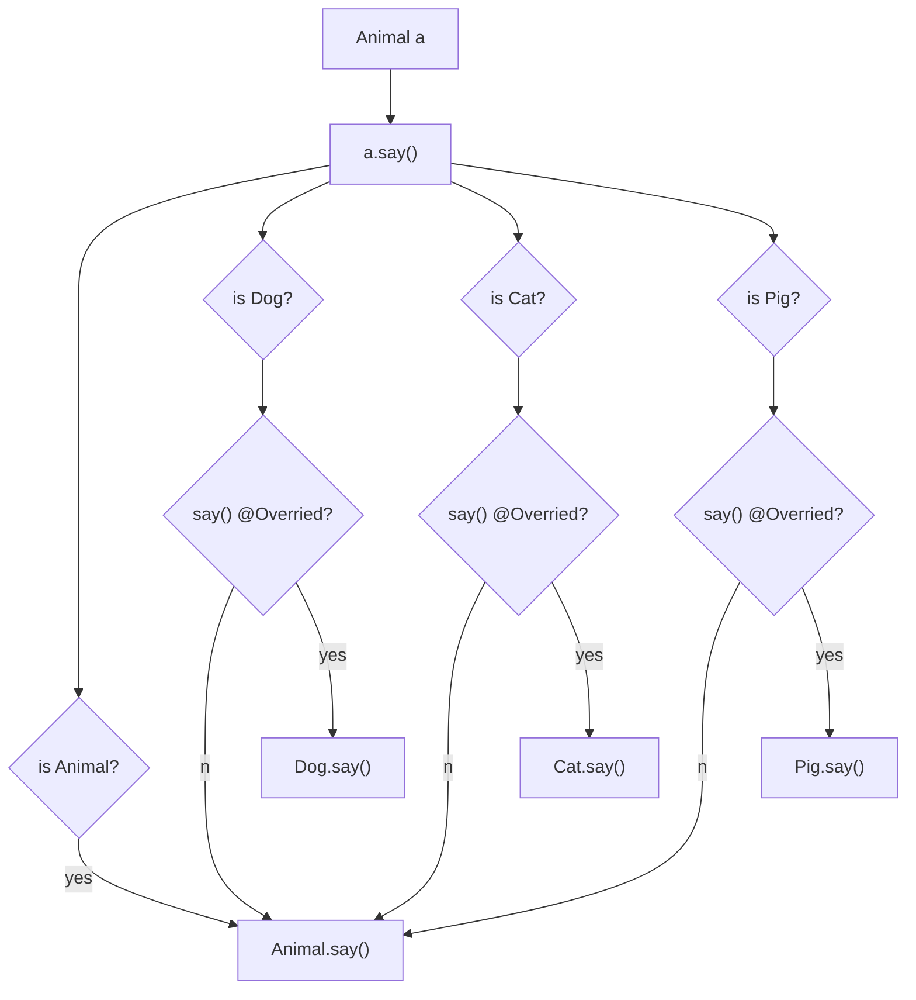

## 四. 多态

###### 1. 何为多态

例如，我这里有多个汽车对象，调用这些汽车对象的 update 方法修改坐标，表面调用的方法都一样，但实际的效果是，它们各自的运动轨迹不同

```js
function draw() {
    for (let i = 0; i < cars.length; i++) {
        let c = cars[i];
        c.update();  // update 方法用来修改坐标
        c.display();
    }
}
```

* cars 是个汽车数组，里面放了3个汽车对象


再比如，我有一个 getAnimals() 方法，会传递过来 Animal 动物数组，但遍历执行 Animal 的方法 say，行为不同

```java
public class TestAnimal {
    public static void main(String[] args) {
        Animal[] animals = getAnimals();
        for (int i = 0; i < animals.length; i++) {
            Animal a = animals[i];
            a.say();
        }
    }
}
```

会输出

```
喵~
汪汪汪
哼哧哼哧
```


如果像上两个例子中体现的：**同一个方法在执行时，表现出了不同的行为**，称这个方法有多态的特性。


###### 2. 多态前提

不是所有方法都有多态，像之前写过的静态方法，不管怎么调用，表现出的行为都是一样的。那么要成为这种多态方法要满足哪些条件呢？先来看看多态这个词是怎么来的

多态，英文 polymorphism 本意是多种形态，是指执行一个相同的方法，最终效果不同。为什么会有这种效果？

方法虽然都是同一个，但调用它们的对象相同吗？看起来都是 Animal 啊，其实不是

* 之前讲向上转型时讲过，子类对象可以向上转型，用父类型代表它
* 这里的每个 Animal a 只是代表右侧对象，右侧的实际对象，是一些子类对象，大家应该都猜出来了，分别是猫、狗、猪
* 这种有多态特性的方法在调用时，会根据实际的对象类型不同而行为不同
* 而正是每个子类对象中的 say 方法写的不一样，从而表现出不同的叫声


方法具备多态性的两个条件：

######## 条件1

用父类型代表子类对象，有了父类型才能代表多种子类型，只有子类型自己，那将来有多种可能吗，不行吧？

* 比如说无论获取数组还是遍历，都使用猪类型，那最终也只能发出猪叫声，这是第一个前提条件

######## 条件2

第二个条件，是子类和父类得有一个相同的 say 方法。如果子类存在与父类相同的方法，称发生了方法重写。重写方法要满足：

1. 方法名和参数都完全相同
2. 对象方法才能重写
3. 检查是否发生了重写可以用 @Override 注解，它可以帮我们检查子类方法是否符合重写规则

只有重写了，才能表现出多种形态，如果没有重写，调用的都是父类方法，最终的效果是相同的，没有多态了


###### 3. 多态执行流程

表面上调用的是 Animal 父类的 say 方法，实际内部会执行下面的逻辑判断



* 循环第一次的 Animal a 代表的是一只猫对象，就会走第三个分支
  * 继续去看，看看猫里面有没有 @Override say() 方法
    * 因为我们重写了 say() 方法，最终就执行的是 Cat.say() 方法
    * 那如果啊我的猫里面没有重写这个方法。最终执行的就是 Animal.say() 方法
* 循环第二次的 Animal a 代表的是一只狗对象，就会走第二个分支
  * 继续去看，看看狗里面有没有 @Override say() 方法
    * 因为我们重写了 say() 方法，最终就执行的是 Dog.say() 方法
* 循环第三次的 Animal a 代表的是一只猪对象，就会走第四个分支
  * 继续去看，看看猪里面有没有 @Override say() 方法
    * 因为我们重写了 say() 方法，最终就执行的是 Pig.say() 方法

总结一下，具有这种多态特性的方法，调用内部就会走这样很多的判断逻辑，当然这些判断是 JVM 虚拟机帮我们判断的，不需要我们自己判断。简单的说，多态方法调用时，得先看变量所代表的对象真正类型是什么。是狗走狗的逻辑，是猫走猫的逻辑。然后呢，优先执行真正类型中的重写方法。如果没有重写方法呢？才执行父类中的方法。这就是这种多态方法执行的流程。


伪代码如下：

```java
Animal a = ...
Class c = a.getClass() // 获得对象实际类型
if(c == Animal.class) {
    执行 Animal.say()
} else if(c == Dog.class && Dog 重写了 say 方法) {
    执行 Dog.say()
} else if(c == Cat.class && Cat 重写了 say 方法) {
    执行 Cat.say()
} else if(c == Pig.class && Pig 重写了 say 方法) {
    执行 Pig.say()
} else {
    执行 Animal.say()
}
```


###### 4. 贷款计算器 - 多态改造

在控制器代码中，需要用 if else 来判断使用哪个 Calculator 对象完成计算，Calculator0 还是 Calculator1，将来如果贷款类型越来越多，就要写好多 if else，如何避免呢？利用多态的原理，让 jvm 帮我们做判断

*  Animal a = ... 利用多态，a 如果代表的是狗对象，走狗的逻辑，代表的是猫对象，走猫的逻辑
* Calculator c = ... 利用多态，c 如果代表的是等额本息对象，走等额本息逻辑，代表的是等额本金对象，走等额本金的计算逻辑

######## 1) 产生方法重写

原来的 

* Calculator0 的方法叫 cal0 和 details0
* Calculator1 的方法叫 cal1 和 details1
* Calculator 父类中没有这俩方法

显然不行

改写如下：

```java
class Calculator {
    // ...
    
    String[] cal() {
        return null;
    }
    
    String[][] details() {
        return null;
    }
}

class Calculator0 extends Calculator {
    Calculator0(double p, int m, double yr) {
        super(p, m, yr);
    }
	@Override
    String[] cal() {
        // ...
    }
	@Override
    String[][] details() {
        // ...
    }

}

class Calculator1 extends Calculator {
    Calculator1(double p, int m, double yr) {
        super(p, m, yr);
    }
	@Override
    String[] cal() {
        // ...
    }
	@Override
    String[][] details() {
        // ...
    }

}
```


######## 2) 父类型代表子类对象

根据类型创建不同 Calculator 对象有点小技巧（避免了创建对象时的 if else），如下：

```java
Calculator[] getCalculator(double p, int m, double yr) {
    return new Calculator[] {
        new Calculator0(p, m, yr),
        new Calculator1(p, m, yr)
    };
}
```

最后通过父类型来执行，表面上是调用 Calculator 父类的 cal() 和 details() 方法，但实际执行的是某个子类的 cal() 和 details() 方法，通过多态，避免了方法调用时的 if else 判断

```java
@Controller
public class CalController {

    Calculator[] getCalculator(double p, int m, double yr) {
        return new Calculator[] {
            new Calculator0(p, m, yr),
            new Calculator1(p, m, yr)
        };
    }

    @RequestMapping("/cal")
    @ResponseBody
    String[] cal(double p, int m, double yr, int type) {
        Calculator[] cs = getCalculator(p, m, yr);
        return cs[type].cal();
    }

    @RequestMapping("/details")
    @ResponseBody
    String[][] details(double p, int m, double yr, int type) {
        Calculator[] cs = getCalculator(p, m, yr);
        return cs[type].details();
    }

}
```

cs[type] 是根据类型找到对应的子类对象，例如

* type = 0 时，其实是获取了数组中索引 0 的对象，即 new Calculator0(p, m, yr)
* type = 1 时，其实是获取了数组中索引 1 的对象，即 new Calculator1(p, m, yr)

######## 3) 多态好处

多态有什么好处呢？

* 比如现在想再加一种贷款计算方式，type = 2
* 无论借多少钱，多少个月，利息总为 0

新增一个 Calculator 子类

```java
public class Calculator2 extends Calculator{
    Calculator2(double p, int m, double yr) {
        super(p, m, yr);
    }

    @Override
    String[] cal() {
        return new String[]{
                NumberFormat.getCurrencyInstance().format(p),
                NumberFormat.getCurrencyInstance().format(0)
        };
    }

    @Override
    String[][] details() {
        String[][] a2 = new String[m][];
        double payment = p / m;
        for (int i = 0; i < m; i++) {            
            p -= payment;
            a2[i] = createRow(payment, i, 0, payment);
        }
        return a2;
    }
}
```

原有代码只需很少改动（扩展性高了）

对于原有的这两个方法来讲，它需要关心你到底是哪个子类对象吗？它不需要关心，因为对于它来讲，它都是统一按照父类型来处理的，通过父类型多态调用方法，具体该调哪个子类方法，多态内部就处理好了

```java
@Controller
public class CalController {

    Calculator[] getCalculator(double p, int m, double yr) {
        return new Calculator[] {
                new Calculator0(p, m, yr),
                new Calculator1(p, m, yr),
            	new Calculator2(p, m, yr)
        };
    }


    @RequestMapping("/cal")
    @ResponseBody
    String[] cal(double p, int m, double yr, int type) {
        Calculator[] cs = getCalculator(p, m, yr);
        return cs[type].cal();
    }

    @RequestMapping("/details")
    @ResponseBody
    String[][] details(double p, int m, double yr, int type) {
        Calculator[] cs = getCalculator(p, m, yr);
        return cs[type].cal();
    }

}
```

可以尝试用原来 if else 的办法自己实现一遍，对比一下代码量。


######## 4) 小结

关于多态的应用的例子讲完了，总结一下

前提

* java 中的类型系统允许用父类型代表子类型对象，这是多态前提之一
* 子类和父类之间发生了方法重写，这是多态前提之二

效果

* 调用父类型的方法，可能会有不同的行为，取决于该方法是否发生了重写

什么时候使用多态

* 多态能够用一个父类型，统一操作子类对象
* 原本要根据类型做判断，写很多 if else 的地方，都可以考虑使用多态来消除 if else，提高扩展性